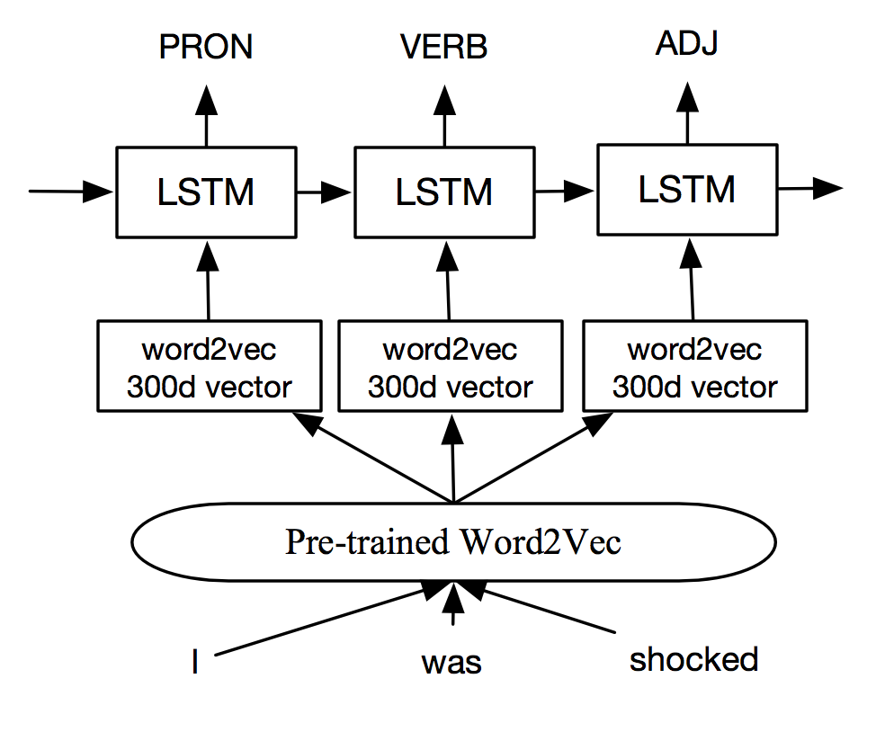
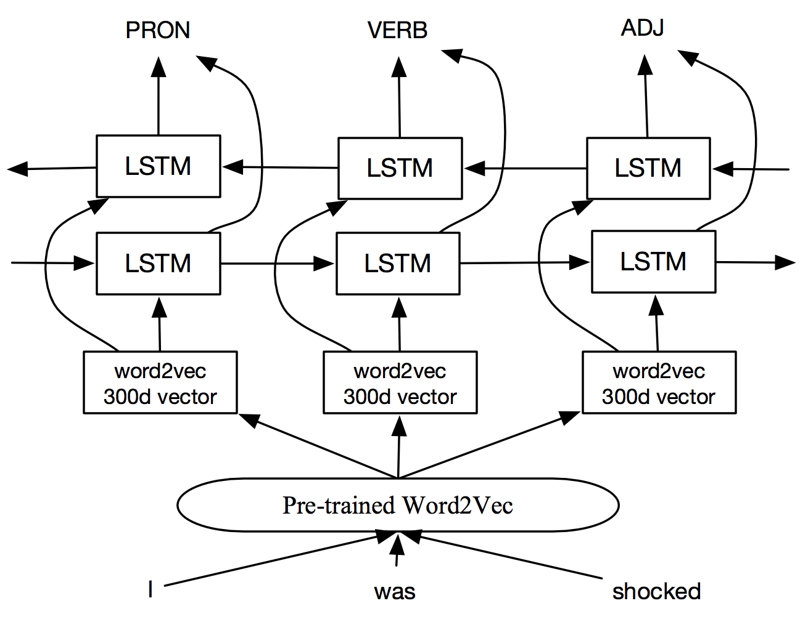
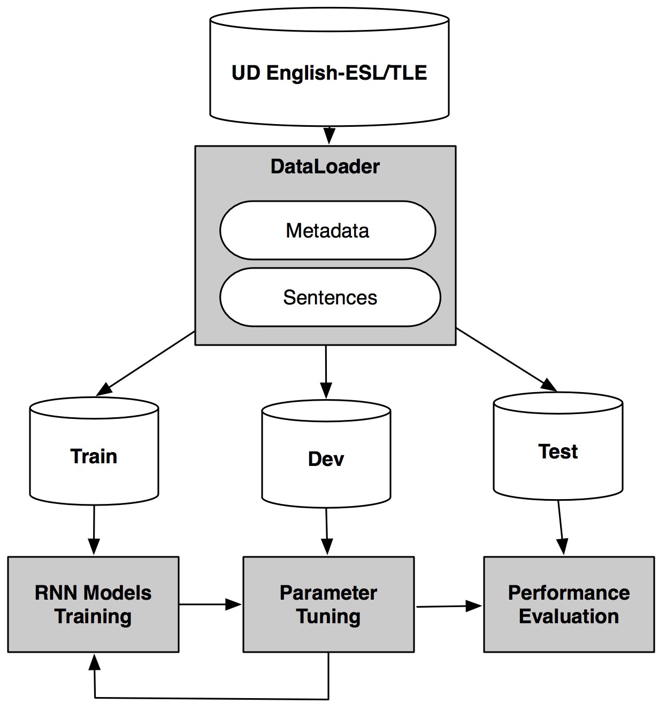
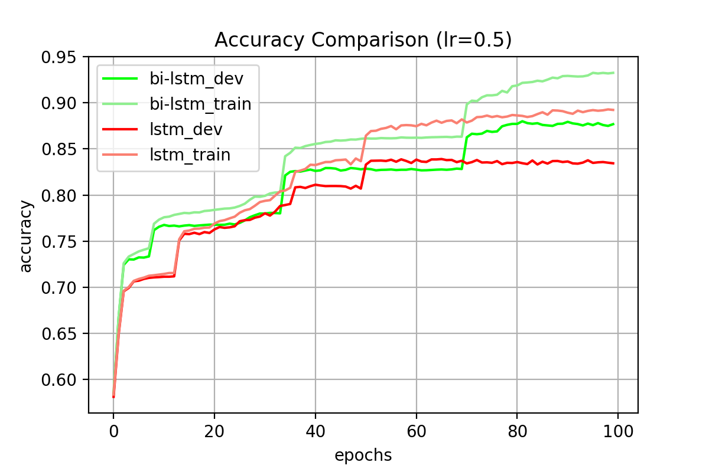
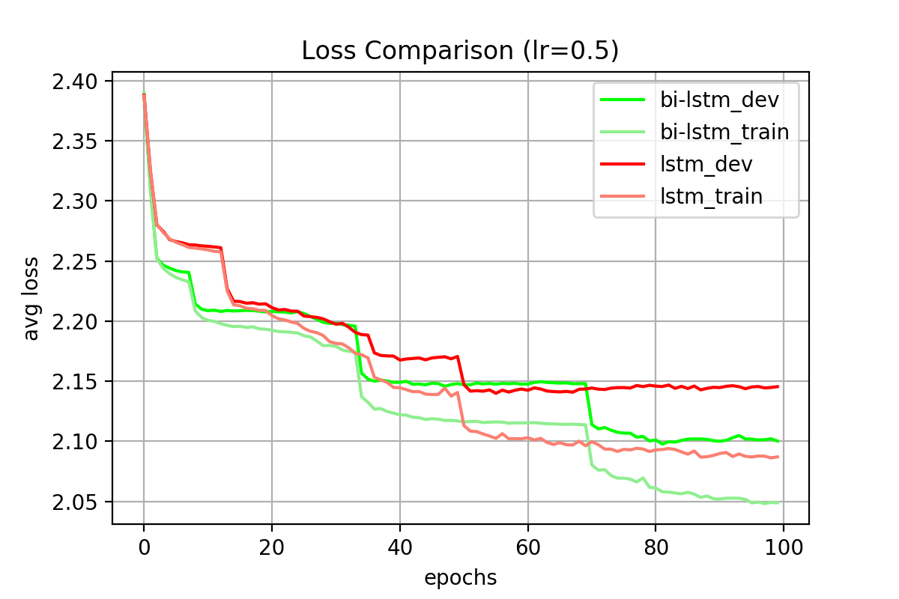
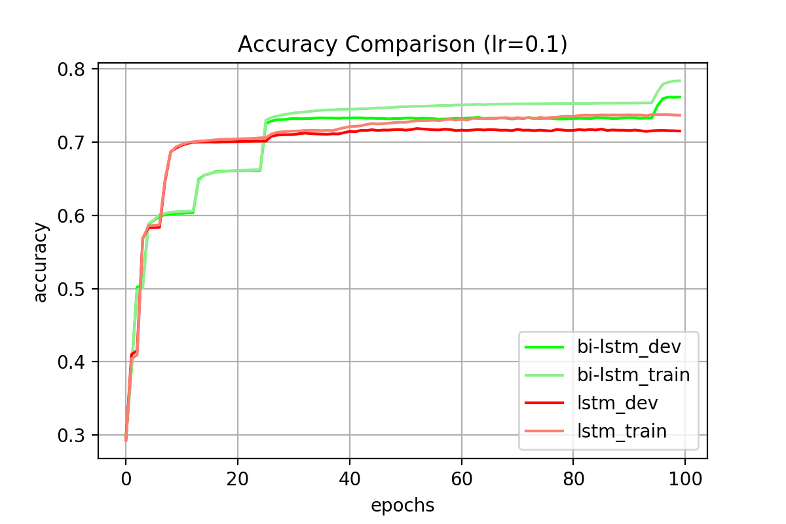
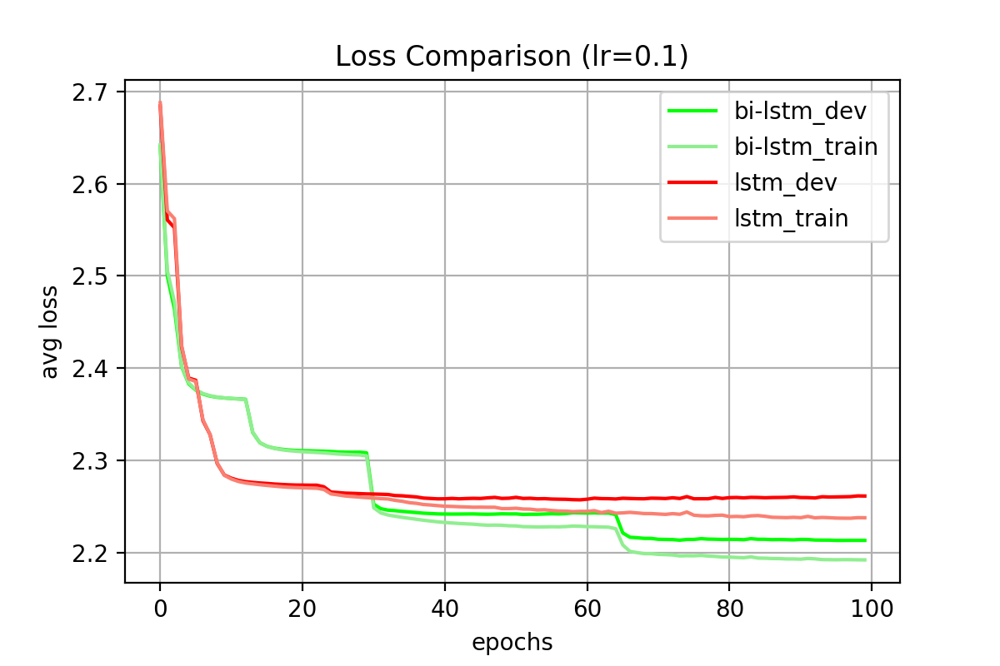
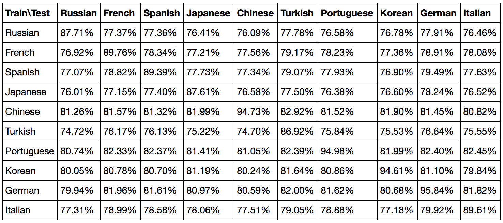

# Part-of-speech tagging for Treebank of Learner English corpora with Recurrent Neural Networks

## Motivation

>Part-of-speech (POS) tagging is the process of marking up a word in a text (corpus) as corresponding to a particular part of speech, based on both its definition and its context. [Wikipedia](https://en.wikipedia.org/wiki/Part-of-speech_tagging)

POS tagging could be the fundamentals of many NLP/NLU tasks, such as Name Entity Recognition (NER) and Abstract Meaning Representation (AMR). In this project, I want to explore the state-of-the-art Recurrent Neural Network (RNN) based models for POS tagging. The following are the candidate models:
- Long Short-Term Memory (LSTM)
- Bidirectional LSTM (BI-LSTM)
- LSTM with a Conditional Random Field (CRF) layer (LSTM-CRF) 
- Bidirectional LSTM with a CRF layer (BI-LSTM-CRF)

I will apply the above models on two tasks:
1. Continuous POS tagging with RNNs
2. POS resemblance between learners with different native language background

(**Update 2018/04/18: task 2 is added**)  
(**Update 2018/04/14: the BI-LSTM is added**)  
(**Update 2018/04/12: the basic LSTM and task 1 is added**)  

## Dataset

>UD English-ESL/TLE is a collection of 5,124 English as a Second Language (ESL) sentences (97,681 words), manually annotated with POS tags and dependency trees in the Universal Dependencies formalism. Each sentence is annotated both in its original and error corrected forms. The annotations follow the standard English UD guidelines, along with a set of supplementary guidelines for ESL. The dataset represents upper-intermediate level adult English learners from 10 native language backgrounds, with over 500 sentences for each native language. The sentences were randomly drawn from the Cambridge Learner Corpus First Certificate in English (FCE) corpus. The treebank is split randomly to a training set of 4,124 sentences, development set of 500 sentences and a test set of 500 sentences. Further information is available at [esltreebank.org](esltreebank.org). 

Citation: (Berzak et al., 2016; Yannakoudakis et al., 2011)


### Data Loader

I've built a data loader for this dataset. To use the data loader, you need to first install the [CoNLL-U Parser](https://github.com/EmilStenstrom/conllu) built by [Emil Stenström](https://github.com/EmilStenstrom). The following is an example to use data_loader:


```python
import data_loader

meta_list, data_list = data_loader.load_data(load_train=True, load_dev=True, load_test=True)

train_meta, train_meta_corrected, \
dev_meta, dev_meta_corrected, \
test_meta, test_meta_corrected = meta_list

train_data, train_data_corrected, \
dev_data, dev_data_corrected, \
test_data, test_data_corrected = data_list
```

### Metadata
- doc_id: filename (also learner ID) of the original xml file
- sent: raw text of the sentence written by the leaner with error corrected tags
- native_language: native language of the leaner
- age_range: age range of the learner
- score: exam score of the learner

Some observations:
- "native_language" enables us to design tasks related to native language identificaiton.
- "age_range" enables us to identify the learner's age based on his/her writing style.
- "score" can help us to group learners into categories, such as Beginner, Intermediate, Expert, Fluent, Proficient. It enables us to discover the writing style and common mistakes of different groups of learners.


```python
train_meta.head()
```


<div>
<table border="1" class="dataframe">
  <thead>
    <tr style="text-align: right;">
      <th>id</th>
      <th>doc_id</th>
      <th>sent</th>
      <th>native_language</th>
      <th>age_range</th>
      <th>score</th>
    </tr>
  </thead>
  <tbody>
    <tr>
      <th>1</th>
      <td>doc2664</td>
      <td>I was &lt;ns type="S"&gt;&lt;i&gt;shoked&lt;/i&gt;&lt;c&gt;shocked&lt;/c&gt;...</td>
      <td>Russian</td>
      <td>21-25</td>
      <td>21.0</td>
    </tr>
    <tr>
      <th>2</th>
      <td>doc648</td>
      <td>I am very sorry to say it was definitely not a...</td>
      <td>French</td>
      <td>26-30</td>
      <td>38.0</td>
    </tr>
    <tr>
      <th>3</th>
      <td>doc1081</td>
      <td>Of course, I became aware of her feelings sinc...</td>
      <td>Spanish</td>
      <td>16-20</td>
      <td>36.0</td>
    </tr>
    <tr>
      <th>4</th>
      <td>doc724</td>
      <td>I also suggest that more plays and films shoul...</td>
      <td>Japanese</td>
      <td>21-25</td>
      <td>33.0</td>
    </tr>
    <tr>
      <th>5</th>
      <td>doc567</td>
      <td>Although my parents were very happy &lt;ns type="...</td>
      <td>Spanish</td>
      <td>31-40</td>
      <td>34.0</td>
    </tr>
  </tbody>
</table>
</div>


### Sentence Format
In this project, we will only use "form" (words) and "upostag" (part-of-speech tags).


```python
train_data[0]
```


<div>
<table border="1" class="dataframe">
  <thead>
    <tr style="text-align: right;">
      <th>id</th>
      <th>form</th>
      <th>lemma</th>
      <th>upostag</th>
      <th>xpostag</th>
      <th>feats</th>
      <th>head</th>
      <th>deprel</th>
      <th>deps</th>
      <th>misc</th>
      <th>meta_id</th>
    </tr>
  </thead>
  <tbody>
    <tr>
      <th>1</th>
      <td>I</td>
      <td>_</td>
      <td>PRON</td>
      <td>PRP</td>
      <td>None</td>
      <td>3</td>
      <td>nsubj</td>
      <td>None</td>
      <td>None</td>
      <td>1</td>
    </tr>
    <tr>
      <th>2</th>
      <td>was</td>
      <td>_</td>
      <td>VERB</td>
      <td>VBD</td>
      <td>None</td>
      <td>3</td>
      <td>cop</td>
      <td>None</td>
      <td>None</td>
      <td>1</td>
    </tr>
    <tr>
      <th>3</th>
      <td>shoked</td>
      <td>_</td>
      <td>ADJ</td>
      <td>JJ</td>
      <td>None</td>
      <td>0</td>
      <td>root</td>
      <td>None</td>
      <td>None</td>
      <td>1</td>
    </tr>
    <tr>
      <th>4</th>
      <td>because</td>
      <td>_</td>
      <td>SCONJ</td>
      <td>IN</td>
      <td>None</td>
      <td>8</td>
      <td>mark</td>
      <td>None</td>
      <td>None</td>
      <td>1</td>
    </tr>
    <tr>
      <th>5</th>
      <td>I</td>
      <td>_</td>
      <td>PRON</td>
      <td>PRP</td>
      <td>None</td>
      <td>8</td>
      <td>nsubj</td>
      <td>None</td>
      <td>None</td>
      <td>1</td>
    </tr>
    <tr>
      <th>6</th>
      <td>had</td>
      <td>_</td>
      <td>AUX</td>
      <td>VBD</td>
      <td>None</td>
      <td>8</td>
      <td>aux</td>
      <td>None</td>
      <td>None</td>
      <td>1</td>
    </tr>
    <tr>
      <th>7</th>
      <td>alredy</td>
      <td>_</td>
      <td>ADV</td>
      <td>RB</td>
      <td>None</td>
      <td>8</td>
      <td>advmod</td>
      <td>None</td>
      <td>None</td>
      <td>1</td>
    </tr>
    <tr>
      <th>8</th>
      <td>spoken</td>
      <td>_</td>
      <td>VERB</td>
      <td>VBN</td>
      <td>None</td>
      <td>3</td>
      <td>advcl</td>
      <td>None</td>
      <td>None</td>
      <td>1</td>
    </tr>
    <tr>
      <th>9</th>
      <td>with</td>
      <td>_</td>
      <td>ADP</td>
      <td>IN</td>
      <td>None</td>
      <td>10</td>
      <td>case</td>
      <td>None</td>
      <td>None</td>
      <td>1</td>
    </tr>
    <tr>
      <th>10</th>
      <td>them</td>
      <td>_</td>
      <td>PRON</td>
      <td>PRP</td>
      <td>None</td>
      <td>8</td>
      <td>nmod</td>
      <td>None</td>
      <td>None</td>
      <td>1</td>
    </tr>
    <tr>
      <th>11</th>
      <td>and</td>
      <td>_</td>
      <td>CONJ</td>
      <td>CC</td>
      <td>None</td>
      <td>8</td>
      <td>cc</td>
      <td>None</td>
      <td>None</td>
      <td>1</td>
    </tr>
    <tr>
      <th>12</th>
      <td>I</td>
      <td>_</td>
      <td>PRON</td>
      <td>PRP</td>
      <td>None</td>
      <td>14</td>
      <td>nsubj</td>
      <td>None</td>
      <td>None</td>
      <td>1</td>
    </tr>
    <tr>
      <th>13</th>
      <td>had</td>
      <td>_</td>
      <td>AUX</td>
      <td>VBD</td>
      <td>None</td>
      <td>14</td>
      <td>aux</td>
      <td>None</td>
      <td>None</td>
      <td>1</td>
    </tr>
    <tr>
      <th>14</th>
      <td>taken</td>
      <td>_</td>
      <td>VERB</td>
      <td>VBN</td>
      <td>None</td>
      <td>8</td>
      <td>conj</td>
      <td>None</td>
      <td>None</td>
      <td>1</td>
    </tr>
    <tr>
      <th>15</th>
      <td>two</td>
      <td>_</td>
      <td>NUM</td>
      <td>CD</td>
      <td>None</td>
      <td>16</td>
      <td>nummod</td>
      <td>None</td>
      <td>None</td>
      <td>1</td>
    </tr>
    <tr>
      <th>16</th>
      <td>autographs</td>
      <td>_</td>
      <td>NOUN</td>
      <td>NNS</td>
      <td>None</td>
      <td>14</td>
      <td>dobj</td>
      <td>None</td>
      <td>None</td>
      <td>1</td>
    </tr>
    <tr>
      <th>17</th>
      <td>.</td>
      <td>_</td>
      <td>PUNCT</td>
      <td>.</td>
      <td>None</td>
      <td>3</td>
      <td>punct</td>
      <td>None</td>
      <td>None</td>
      <td>1</td>
    </tr>
  </tbody>
</table>
</div>


## RNN Models

In this project, we mainly use [PyTorch](http://pytorch.org/) to implement the RNN models. The following are what I've already implemented:

### Long Short-Term Memory (LSTM)
>Long short-term memory (LSTM) units (or blocks) are a building unit for layers of a recurrent neural network (RNN). A RNN composed of LSTM units is often called an LSTM network. A common LSTM unit is composed of a cell, an input gate, an output gate and a forget gate. The cell is responsible for "remembering" values over arbitrary time intervals; hence the word "memory" in LSTM. [Wikipedia](https://en.wikipedia.org/wiki/Long_short-term_memory)

The following is the high-level architecture for the LSTM model:



### Bidirectional LSTM (BI-LSTM)

The BI-LSTM model is derived from Bidrectional RNN (BRNN) (Schuster and Paliwal, 1997).

>The principle of BRNN is to split the neurons of a regular RNN into two directions, one for positive time direction (forward states), and another for negative time direction (backward states). Those two states’ output are not connected to inputs of the opposite direction states. By using two time directions, input information from the past and future of the current time frame can be used unlike standard RNN which requires the delays for including future information. [Wikipedia](https://en.wikipedia.org/wiki/Bidirectional_recurrent_neural_networks)

The BI-LSTM is based on BRNN but replaces the RNN units with LSTM units. The following is the high-level architecture for the BI-LSTM model:




## Task 1: Continuous POS tagging with RNNs

### Architecture

In this task, a POS tagger was trained with all train data (4124 sentences), validated with dev data (500 sentences), and tested with test data (500 sentences). The following is the architecture:




### Word Features

We use the pre-trained [Word2Vec model](https://drive.google.com/file/d/0B7XkCwpI5KDYNlNUTTlSS21pQmM/edit) built with Google News corpus (3 million 300-dimension English word vectors). Although it might not be the best choice (e.g. Google News corpus might not be representative for the English Learner text), it's still a legitimate choice: 1) It saves my time to build a large dictionary which cover all words in the UD English-ESL/TLE corpus; 2) It saves my time and computing resources to build large/sparse unigram vectors for words, and I don't need to worry about dimension reduction for now; 3) 300-dim w2v vector is small enough for this task, and the dimension is fixed so the vector can be directly used in NN. 4) It's free and available on Google Drive :). 

### Experiments

#### Performance

The dataset was divided into train, dev, test sets. We used train and dev sets to observe the fluctuation of accuracy and loss during the training process of 1000 epochs. There are 17 different POS tags in this experiment. The prediction is considered as true postive only if it is the same as the actual POS tag. The optimizer of RNNs is Stochastic Gradient Descent (SGD) with different learning rate (lr). The loss function is Cross Entropy Loss.

The following is the best performance after 100 epochs:

- lr = 0.5

| Model | Train Accuracy | Dev Accuracy  | Test Accuracy |
| ------------- |:-------------|:-------------|:-------------:|
| LSTM  | 89.28% | 83.90% | 89.20% |
| BI-LSTM  | 93.25% | 88.00% | 93.30% |

- lr = 0.1

| Model | Train Accuracy | Dev Accuracy  | Test Accuracy |
| ------------- |:-------------|:-------------|:-------------:|
| LSTM  | 73.77% | 71.86% | 74.11% |
| BI-LSTM  | 78.37% | 76.17% | 78.54% |

The BI-LSTM model consistantly performs better than the LSTM model and achieve 93% in accuracy (lr=0.5). 

#### Parameter Tuning

The following are train/dev accuracy and loss in 100 epochs:

- lr = 0.5




- lr = 0.1





According to the following figures, both LSTM and BI-LSTM are not apparent overfitting. BI-LSTM learned faster and better than LSTM model.


## Task 2: POS resemblance between learners with different native language background

In this task, I would like to discover the POS resemblance between learners with different native language background. The basic hypothesis is that a person's writing style in English is subconsciously influeced by the grammar of his/her native language. For example, the basic sentence structure in English is (Subject+Verb+Object), but in Japanese is (Subject+Object+Verb). Moreover, some languages do not have strict rules about the grammatical order of words, but they have abundant morphemes to construct sentences.

In the following experiments, we use the train data in the dataset. Here are some stats of the train data regarding learner's native language background.


```python
import data_loader
import pandas as pd

meta_list, data_list = data_loader.load_data(load_train=True, load_dev=False, load_test=False)
train_meta, train_meta_corrected = meta_list
train_data, train_data_corrected  = data_list
```


```python
languages = train_meta["native_language"].unique()
print("# of Sentence: {}".format(len(train_meta)))

print("Sentence distribution:")
stats = []
for language in languages:
    stats.append(len(train_meta[train_meta["native_language"]==language]))
stats_df = pd.DataFrame(stats, columns=["# of sentences"], index=languages)
print(stats_df)

print("Author distribution:")
stats = []
for language in languages:
    stats.append(len(train_meta[train_meta["native_language"]==language]["doc_id"].unique()))
stats_df = pd.DataFrame(stats, columns=["# of authors"], index=languages)
print(stats_df)

stats = []
languages = train_meta["native_language"].unique()
print("Exam score stats:")
for language in languages:
    stats.append(train_meta[train_meta["native_language"]==language]["score"].describe()[['count', 'mean', 'std', 'max', 'min']])
stats_df = pd.DataFrame(stats, index=languages)
print(stats_df)
```

    # of Sentence: 4124
    Sentence distribution:
                # of sentences
    Russian                427
    French                 401
    Spanish                428
    Japanese               407
    Chinese                414
    Turkish                404
    Portuguese             407
    Korean                 413
    German                 400
    Italian                423
    Author distribution:
                # of authors
    Russian               81
    French               131
    Spanish              175
    Japanese              81
    Chinese               66
    Turkish               73
    Portuguese            68
    Korean                84
    German                69
    Italian               76
    Exam score stats:
                count       mean       std   max   min
    Russian     427.0  26.288056  6.179166  40.0   9.0
    French      401.0  27.630923  4.666738  40.0  17.0
    Spanish     428.0  26.789720  5.349402  40.0  11.0
    Japanese    407.0  27.547912  5.040432  39.0  15.0
    Chinese     414.0  26.268116  6.210832  40.0  14.0
    Turkish     404.0  27.834158  5.494389  39.0   7.0
    Portuguese  407.0  27.791155  4.963723  39.0  11.0
    Korean      413.0  25.980630  6.019355  40.0  12.0
    German      400.0  27.725000  5.880546  40.0  13.0
    Italian     423.0  28.699764  4.388392  38.0  20.0


We train BI-LSTM models (500 epochs, SGD learning rate=0.5) for sentences in every lanugage respectively, and then test the tagging accuracy on sentences in other languages. That is, we train a POS tagger based on sentences written by learners with Japanese native language background, and use the tagger to tag sentences written by learners with other native language background. The following are the results of POS tagging accuracy.



The diagonal numbers show how well the models fit their training data. Although it shows some models learned faster and some learned slower, unfortunately, so far there is no significant proof that any pair of languages is more or less similar with each other in the perspective of POS resemblance. 

However, under the same experiment settings, we still learned some from the results:
- Models trained by learners with Chinese, Portuguese, Korean and German native language background learn faster and perform better in POS tagging.
- In some pairs of languages, there is higher difference between (train on language A -> test on language B) and (train on language B -> test on language A).


## References

1. Berzak, Y., Kenney, J., Spadine, C., Wang, J. X., Lam, L., Mori, K. S., ... & Katz, B. (2016). Universal dependencies for learner English. arXiv preprint arXiv:1605.04278.
2. Yannakoudakis, H., Briscoe, T., & Medlock, B. (2011, June). A new dataset and method for automatically grading ESOL texts. In Proceedings of the 49th Annual Meeting of the Association for Computational Linguistics: Human Language Technologies-Volume 1 (pp. 180-189). Association for Computational Linguistics.
3. Schuster, M., & Paliwal, K. K. (1997). Bidirectional recurrent neural networks. IEEE Transactions on Signal Processing, 45(11), 2673-2681.
